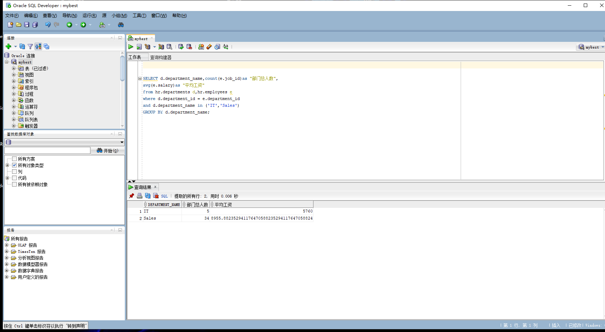
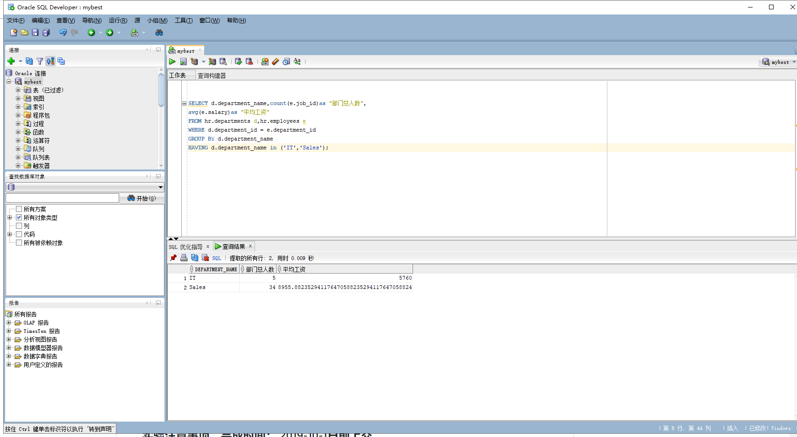
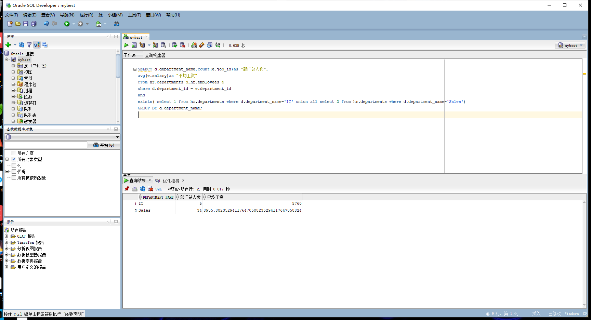

## 实验一：SQL语句的执行计划分析与优化指导

## 1.教材中的查询语句分析

查询结果展示:
---



---

查询1比查询2的sql语句更优！

分析： where自居仅仅用于从from子句中返回的值，from子句返回的每一行数据都会用where子句中的条件进行判断筛选.having子句通常是与order by 子句一起使用的。因为having的作用是对使用group by进行分组统计后的结果进行进一步的筛选。所以在这个例子中where的效率要比having高。

- 优化指导：





- 查询1具有优化指导建议考虑改进物理方案设计的访问指导或者创建推荐的索引。

- 查询2无优化指导

### 自己的查询代码

```SQL
SELECT d.department_name,count(e.job_id)as "部门总人数",
avg(e.salary)as "平均工资"
from hr.departments d,hr.employees e
where d.department_id = e.department_id
and 
exists( select 1 from hr.departments where d.department_name='IT' union all select 2 from hr.departments where d.department_name='Sales')
GROUP BY d.department_name;
```

- 查询结果：




- 分析：exists 判断子查询是否返回，类似一个布尔判断，in 的话要执行完子查询再执行主查询，方式不一样，exists方式明显快于in。
