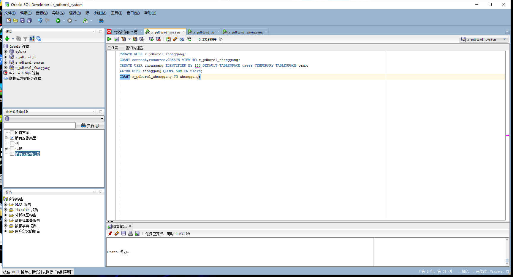
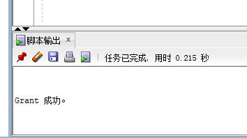
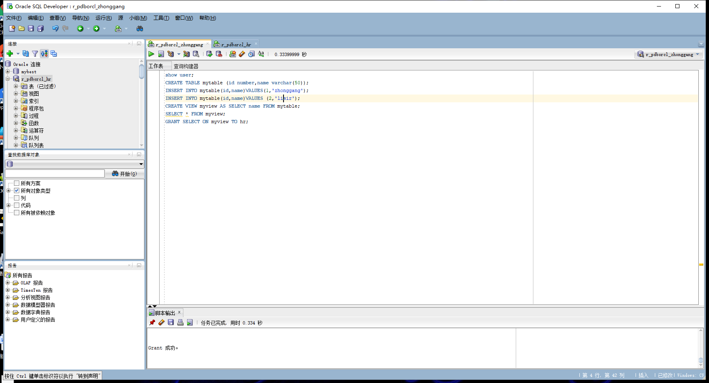
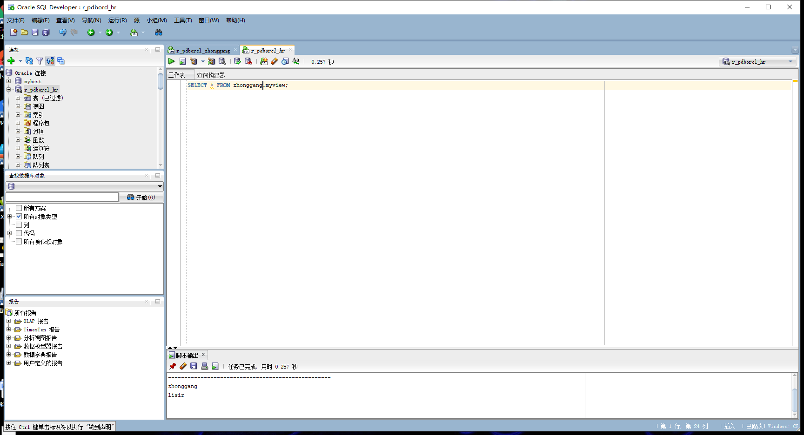
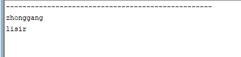

## 实验二：用户及权限管理
### 第一步:  以system登录到pdborcl中，创建角色 r_pdborcl_zhonggang和用户zhonggang

创建代码：
```SQL
CREATE ROLE r_pdborcl_zhonggang;
GRANT connect,resource,CREATE VIEW TO r_pdborcl_zhonggang;
CREATE USER zhonggang IDENTIFIED BY 123 DEFAULT TABLESPACE users TEMPORARY TABLESPACE temp;
ALTER USER zhonggang QUOTA 50M ON users;
GRANT r_pdborcl_zhonggang TO zhonggang;
```

- 创建及其结果展示：




### 第二步： 新用户zhonggang连接到pdborcl,创建表mytable和表myview

```sql
show user;
CREATE TABLE mytable (id number,name varchar(50));
INSERT INTO mytable(id,name)VALUES(1,'zhonggang');
INSERT INTO mytable(id,name)VALUES (2,'lisir');
CREATE VIEW myview AS SELECT name FROM mytable;
SELECT * FROM myview;
GRANT SELECT ON myview TO hr;
```

- 结果展示：



### 第三步： 用户hr连接到pdborcl,查询zhonggang授予它的视图myview
```sql
SELECT * FROM liushuang.myview;
```
- 结果展示：

