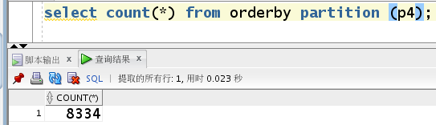
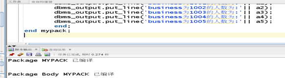

##实验六：基于oracle的网络购物的数据库设计
###实验要求：
      1.自行设计一个信息系统的数据库项目，自拟某项目名称。
      2.设计项目涉及的表及表空间使用方案。至少5张表和5万条数据，两个表空间。
      3.设计权限及用户分配方案。至少两类角色，两个用户。
      4.在数据库中建立一个程序包，在包中用PL/SQL语言设计一些存储过程和函数，实现比较复杂的业务逻辑，用模拟 数据进行执行计划分析。
      5.设计自动备份方案或则手工备份方案。
      6.设计容灾方案。使用两台主机，通过DataGuard实现数据库整体的异地备份。
##一、创建zgmail数据库，表空间，表以及用户
### 1.创建数据库zgmail，并且创建数据库管理员zg
```sql
CREATE PLUGGABLE database zgmail admin user zg identified by 123 file_name_convert=
('/home/oracle/app/oracle/oradata/orcl/pdbseed/',' 
/home/oracle/app/oracle/oradata/orcl/zgmail');
```
结果如下:

### 2.创建表空间（zg_space1,zg_space2,zg_space3和zg_space4）
```sql
create tablespace 
zg_space1
datafile '/home/oracle/app/oracle/oradata/orcl/zgmail/zg_space1.dbf' 
size 150M 
autoextend on next 50m
maxsize unlimited;
```
结果如下所示（只展示了zg_space1的sql语句和结果图）：

### 3.创建表以及将订单表（orderby）进行分区
#### 3.1创建商品表
```sql
create table commodity(
commodity_no char(5) not null primary key,
commodity_name char(25) not null,
commodity_class char(8),
commodity_spec	char(10),
commodity_brand	char(10),
intake_price	float not null CHECK(intake_price > 0),
outtake_price float not null CHECK(outtake_price > 0)
)TABLESPACE zg_space1;
```
创建结果：

#### 3.2创建商品库存表
```sql
create table stock(
stock_no	char(5),
commodity_no char(5),
size_	char(10),
position_	char(20),
store_time	char(10),
take_time	char(10),
take_size	char(10),
CONSTRAINT stock_commodity_fk1 FOREIGN KEY (commodity_no) REFERENCES commodity(commodity_no)
)TABLESPACE zg_space1;
```
创建结果：

#### 3.3创建商家表
```sql
create table bussiness(
business_no	char(5) not null PRIMARY KEY,
business_name	char(10) not null,
sex	char(2) not null CHECK(sex IN('男','')),
birthday	    char(10),
Creation_time	char(10) not null
)TABLESPACE zg_space1;
```
创建结果展示

#### 3.4对订单表进行分区
```sql
create table orderby(
order_no	char(5) not null PRIMARY KEY,
business_no	char(5) not null,
delete_	 char(2 byte),
price	float(126),
order_date	date not null,
CONSTRAINT order_FORM_bussiness_fk1 FOREIGN KEY (business_no) REFERENCES bussiness (business_no)
) partition by range (order_date)
 (
partition p1 values LESS THAN (TO_DATE(' 2017-01-01 00:00:00', 'SYYYY-MM-DD HH24:MI:SS', 'NLS_CALENDAR=GREGORIAN')) tablespace zg_space1,

    partition p2 values LESS THAN (TO_DATE(' 2018-01-01 00:00:00', 'SYYYY-MM-DD HH24:MI:SS', 'NLS_CALENDAR=GREGORIAN')) tablespace zg_space2,
    partition p3 values LESS THAN (TO_DATE(' 2019-01-01 00:00:00', 'SYYYY-MM-DD HH24:MI:SS', 'NLS_CALENDAR=GREGORIAN')) tablespace zg_space3,
    
    partition p4 values LESS THAN (MAXVALUE) tablespace zg_space4)
```
创建结果

#### 3.5创建顾客表
```sql
create table customer(
customer_no	char(5) not null PRIMARY KEY,
customer_name	char(10) not null,
sex	char(2) not null CHECK(sex IN('男','女')),
tel	char(11),
address	char(20),
order_no	char(5)
)TABLESPACE zg_space1;
```
创建结果

### 4.创建用户，授权，插入数据
#### 4.1创建两个用户zg1和zg2允许使用zg_space1的表空间
```sql
create user zg1 IDENTIFIED by 123;
create user zg2 IDENTIFIED by 123;
alter user zg1 quota unlimited on zg_space1;
alter user zg2 quota unlimited on zg_space1;
```
结果展示

#### 4.2创建两个角色role1和role2，并且分别赋予查看和更新的权限
```sql
create role role1;
create role role2;
grant select any table to role1;
grant select any table to role2;
grant update any table to role1;
grant update any table to role2;
```
结果展示

####4.3将两个角色role1和role2分别交给两个用户zg1和zg2
```sql
grant role1 to zg1;
grant role2 to zg2;
```
结果展示

####4.4向表中插入数据(部分数据)
```sql
declare
 dt date;
 order_no char(5);
 business_no char(5);
 delete_ char(2);
 price float;
 begin
 insert into commodity(commodity_no,commodity_name,commodity_class,commodity_spec,commodity_brand,intake_price,outtake_price)
    values('1','小米1','电产','发烧机','小米',1000,2000);
    .
    .
    insert into bussiness(business_no,business_name,sex,birthday,Creation_time)
    values('1001','海尔','1','1998','1');
    .
    .
     for i in 1..50000
    loop 
       if i mod 3 =0 then
       dt:=to_date('2017-01-01','yyyy-mm-dd')+(i mod 60);--PARTITION_2017
       elsif i mod 6 =1 then
       dt:=to_date('2018-01-01','yyyy-mm-dd')+(i mod 60);--PARTITION_2018
       elsif i mod 6 =2 then
       dt:=to_date('2019-01-01','yyyy-mm-dd')+(i mod 60);--PARTITION_2019
       end if;
       --插入订单
       order_no := i;
       business_no := case i mod 6 when 0 then '1001' when 1 then '1002' when 2 then '1003' when 3 then '1004' else '1005' end;
       delete_ := case i mod 2 when 0 then '1' else '0' end;
       price := dbms_random.value(5,30);
       
       insert into orderby (order_no,business_no,delete_,price,order_date)
       values(order_no,business_no,delete_,price,dt);
       end loop;
       end;
```
结果展示

####4.5验证用户zg1和zg2授权操作是否成功
操作截图


####4.6查看数据是否分区插入到不同的表空间了
验证结果如图



### 二、建立程序包
建立一个程序包里面主要包括了一个函数和一个存储过程，其功能是：统计一段时间内商品销售的总收入；统计一段时间内各个商品的售卖数量。
sql语句如下
```sql
create or replace PACKAGE mypack is
FUNCTION get_total(dt1 char,dt2 char)RETURN number;
PROCEDURE get_number(dt1 char,dt2 char);
end mypack;
/
create or replace package body mypack is
function get_total(dt1 char,dt2 char)return number
   AS
     n number;
      begin
        select sum(price) into n from orderby where order_date >=to_date(dt1,'yyyy-mm-dd hh24:mi:ss')
        and order_date <=to_date(dt2,'yyyy-mm-dd hh24:mi:ss');
         return n;
        end;
        
--得到每段时间的销售数量

PROCEDURE get_number(dt1 char,dt2 char)
   AS
     a1 number;
     a2 number;
     a3 number;
     a4 number;
     a5 number;
     
     cursor cur is
       select * from orderby where order_date >=to_date(dt1,'yyyy-mm-dd hh24:mi:ss')
       and order_date <=to_date(dt2,'yyyy-mm-dd hh24:mi:ss');
     begin
       a1 :=0;
       a2 :=0;
       a3 :=0;
       a4 :=0;
       a5 :=0;
       
       for v in cur 
       loop
         if v.business_no='1001'
         then a1 :=a1+1;
         elsif v.business_no='1002'
         then a2 :=a2+1;
         elsif v.business_no='1003'
         then a3 :=a3+1;
         elsif v.business_no='1004'
         then a4 :=a4+1;
         elsif v.business_no='1005'
         then a5 :=a5+1;
         end if;
       end loop;
       dbms_output.put_line('business为1001的人数为:'|| a1);
       dbms_output.put_line('business为1002的人数为:'|| a2);
       dbms_output.put_line('business为1003的人数为:'|| a3);
       dbms_output.put_line('business为1004的人数为:'|| a4);
       dbms_output.put_line('business为1005的人数为:'|| a5);
       end;
end mypack;
```
结果如下

函数效果展示

存储过程效果展示

###三、系统备份
####1.开始全备份
```sql
[oracle@oracle-pc ~]$ cat rman_level0.sh
```
####2.每天定时备份

####3.执行脚本对数据库进行备份

####4.删除数据库文件


####5.1重启损坏的数据库到mount状态

####5.2开始恢复数据库

####5.3查看是否已经恢复

####6删除备份集
